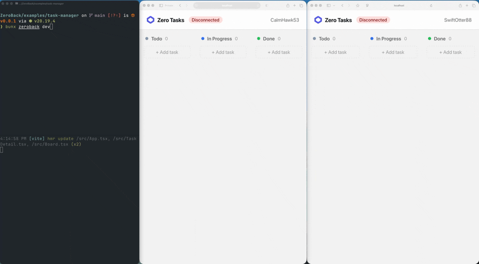

# Zeroback

[](https://opensource.org/licenses/MIT)

An open-source [Convex](https://convex.dev)-style backend you deploy to your own Cloudflare account. Real-time queries, mutations, type-safe codegen — all running on Cloudflare Workers, Durable Objects, and SQLite.

> 📖 [Why I Built Zeroback](https://zeroback.dev/blog/why-i-built-zeroback) — the backstory

<p align="center">
  
</p>

## Get Started

```bash
npx @zeroback/cli init my-app
cd my-app
npm install @zeroback/server
zeroback dev
```

Edit `zeroback/schema.ts` and `zeroback/tasks.ts`, and you have a real-time backend. Add `@zeroback/client` and `@zeroback/react` when you're ready to connect your frontend.

## Why Zeroback?

Convex introduced a great developer experience: define your backend as plain TypeScript functions, get real-time subscriptions and a type-safe client for free. Zeroback brings that same model to Cloudflare's edge infrastructure — giving you full control over your data and deployment.

- **Your Cloudflare account** — data lives in your Durable Objects, not a third-party service
- **Real-time subscriptions** — queries re-run and push updates over WebSocket when data changes
- **Type-safe codegen** — generated `api` object gives you end-to-end type safety from database to UI
- **Optimistic concurrency control** — mutations are checked for conflicts before committing
- **Database indexes** — declare indexes in your schema, query them with `.withIndex()` for efficient lookups
- **Full-text search** — declare search indexes in your schema, query with `.search()` for relevance-ranked results powered by SQLite FTS5
- **Pagination** — built-in cursor-based pagination with `.paginate()`
- **Single Durable Object** — all state, transactions, and WebSocket connections in one place for strong consistency
- **Offline support** — opt-in IndexedDB persistence for instant cached renders, offline reads, and mutation replay

## Quick Start

### 1. Scaffold a new project

```bash
npx @zeroback/cli init my-app
cd my-app
npm install @zeroback/server
```

### 2. Define your schema

```ts
// zeroback/schema.ts
import { defineSchema, defineTable, v } from "@zeroback/server"

export const schema = defineSchema({
  tasks: defineTable({
    text: v.string(),
    isCompleted: v.boolean(),
  }),
})
```

### 3. Write your functions

```ts
// zeroback/tasks.ts
import { query, mutation, v } from "./_generated/server"

export const list = query({
  args: {},
  handler: async (ctx) => {
    return await ctx.db.query("tasks").order("desc").take(50)
  },
})

export const create = mutation({
  args: {
    text: v.string(),
  },
  handler: async (ctx, args) => {
    await ctx.db.insert("tasks", { text: args.text, isCompleted: false })
  },
})

export const toggle = mutation({
  args: {
    id: v.id("tasks"),
  },
  handler: async (ctx, args) => {
    const task = await ctx.db.get(args.id)
    if (!task) throw new Error("Task not found")
    await ctx.db.patch(args.id, { isCompleted: !task.isCompleted })
  },
})
```

### 4. Use in React

First, install the client package:

```bash
npm install @zeroback/react
```

Then use them in your React app:

```tsx
import { ZerobackClient, ZerobackProvider, useQuery, useMutation } from "@zeroback/react"
import { api } from "../zeroback/_generated/api"

const client = new ZerobackClient("ws://localhost:8788/ws")

function Tasks() {
  const tasks = useQuery(api.tasks.list)
  const create = useMutation(api.tasks.create)
  const toggle = useMutation(api.tasks.toggle)

  return (
    <div>
      {tasks?.map((task) => (
        <p key={task._id} onClick={() => toggle({ id: task._id })}>
          {task.isCompleted ? "✅" : "⬜"} {task.text}
        </p>
      ))}
      <button onClick={() => create({ text: "New task" })}>
        Add Task
      </button>
    </div>
  )
}

function App() {
  return (
    <ZerobackProvider client={client}>
      <Tasks />
    </ZerobackProvider>
  )
}
```

### 5. Start development

```bash
zeroback dev
```

This will:

1. Analyze your `zeroback/` directory for schema and function definitions
2. Generate type-safe code in `zeroback/_generated/`
3. Start a local Cloudflare Worker with Durable Objects
4. Watch for changes and rebuild automatically

## Architecture

```
┌───────────────────────────────────────────────────────────┐
│  React App                                                │
│  useQuery(api.tasks.list)                                 │
│  useMutation(api.tasks.create)                            │
└────────────────────────┬──────────────────────────────────┘
                         │ WebSocket
┌────────────────────────▼──────────────────────────────────┐
│  Cloudflare Worker                                        │
│  Routes requests to Durable Object                        │
│ ┌───────────────────────────────────────────────────────┐ │
│ │  ZerobackDO (Durable Object)                          │ │
│ │                                                       │ │
│ │  ┌──────────────┐ ┌──────────────┐ ┌───────────────┐  │ │
│ │  │ User         │ │ Transaction  │ │ Subscription  │  │ │
│ │  │ Functions    │ │ Store        │ │ Manager       │  │ │
│ │  │ (bundled)    │ │ (OCC)        │ │ (realtime)    │  │ │
│ │  └──────────────┘ └──────────────┘ └───────────────┘  │ │
│ │                                                       │ │
│ │  ┌─────────────────────────────────────────────────┐  │ │
│ │  │  SQLite (Durable Object Storage)                │  │ │
│ │  │  documents + indexes + scheduled jobs           │  │ │
│ │  └─────────────────────────────────────────────────┘  │ │
│ └───────────────────────────────────────────────────────┘ │
└───────────────────────────────────────────────────────────┘
```

**Single Durable Object.** Everything — queries, mutations, subscriptions, and WebSocket connections — runs inside one Durable Object instance. This gives you strong consistency without distributed coordination, but it also means your app is bound by the limits of a single DO.

**User functions run in-process.** Your `zeroback/` functions are bundled into the worker and executed directly inside the Durable Object — no inter-service RPCs.

### Limits of a single Durable Object

Zeroback runs entirely within one Cloudflare Durable Object. This keeps the architecture simple and strongly consistent, but comes with inherent platform constraints:

| Limit | Value | Notes |
|-------|-------|-------|
| **Concurrent WebSocket connections** | ~1,000 | Self-imposed (`MAX_CONNECTIONS`). The real bottleneck is the single-threaded CPU — each message is processed sequentially |
| **SQLite storage** | 10 GB | Cloudflare Durable Object storage limit |
| **CPU per request** | 30s (Workers paid plan) | Each mutation/query must complete within this budget |
| **Single-threaded execution** | 1 core | All queries, mutations, and subscription invalidations share one thread |

For many apps (internal tools, collaborative docs, moderate-traffic SaaS), these limits are more than enough. If you need to scale beyond a single DO, you would need to shard across multiple Durable Objects — this is not built-in today.

## Packages

| Package | Description |
|---------|-------------|
| `@zeroback/server` | Define schemas, queries, mutations. Database reader/writer, query builder, filter DSL |
| `@zeroback/client` | WebSocket client with auto-reconnect, subscription management, mutation queue, IndexedDB persistence |
| `@zeroback/react` | `ZerobackProvider`, `useQuery`, `useMutation`, `useAction`, `usePaginatedQuery`, `useQueryWithStatus`, `useConnectionState` |
| `@zeroback/solid` | Solid.js bindings: `ZerobackProvider`, `createQuery`, `createQueryWithStatus`, `createMutation`, `createAction`, `createPaginatedQuery`, `createConnectionState` |
| `@zeroback/values` | Validator library (`v.string()`, `v.number()`, `v.object()`, etc.) for schema and args |
| `@zeroback/cli` | `zeroback init`, `zeroback dev`, `zeroback deploy`, `zeroback codegen`, `zeroback run`, `zeroback reset` — scaffold, develop, deploy |

## Documentation

- **[Schema & Validators](https://zeroback.dev/schema)** — `defineSchema`, `defineTable`, `v.*` validators, indexes, search indexes
- **[Functions](https://zeroback.dev/functions)** — queries, mutations, actions, internal functions, HTTP actions, cron jobs, codegen
- **[Database](https://zeroback.dev/database)** — reading, writing, QueryBuilder, filters, indexes, pagination, full-text search
- **[Client SDK](https://zeroback.dev/client)** — `ZerobackClient`, subscriptions, optimistic updates, persistence
- **[React Hooks](https://zeroback.dev/react)** — `useQuery`, `useMutation`, `useAction`, `usePaginatedQuery`
- **[Solid.js](https://zeroback.dev/solid)** — `createQuery`, `createMutation`, `createAction`, `createPaginatedQuery`
- **[CLI](https://zeroback.dev/cli)** — `zeroback init`, `zeroback dev`, `zeroback deploy`, `zeroback codegen`, `zeroback run`, `zeroback reset`
- **[Authentication](https://zeroback.dev/authentication)** — token-based auth, user identity in functions
- **[Scheduling](https://zeroback.dev/scheduling)** — `scheduler.runAfter`, `scheduler.runAt`, cron jobs
- **[File Storage](https://zeroback.dev/storage)** — upload, serve, and manage files via Cloudflare R2
- **[Deployment](https://zeroback.dev/deployment)** — deploy to Cloudflare Workers
- **[How It Works](https://zeroback.dev/how-it-works)** — real-time subscriptions, OCC, type-safe codegen

## Project Structure

```
your-project/
├── zeroback/                      # Your backend code
│   ├── schema.ts             # Table definitions
│   ├── tasks.ts              # Query & mutation functions
│   └── _generated/           # Auto-generated (don't edit)
│       ├── api.ts            # Typed API references
│       ├── server.ts         # Typed query/mutation factories
│       └── dataModel.ts      # TypeScript types for tables
├── src/                      # Your frontend code
│   └── App.tsx
├── wrangler.toml             # Scaffolded by zeroback init, user can customize
├── package.json
└── .zeroback/
    └── entry.ts              # Scaffolded by zeroback init, user can customize
```

Both `wrangler.toml` and `.zeroback/entry.ts` are scaffolded once by `zeroback init` and owned by the user — you can customize them freely. The entry file imports from `zeroback/_generated/manifest.ts` (regenerated on every build), which wires your functions and schema to the `@zeroback/server/runtime`.

The `wrangler.toml` at project root points to `.zeroback/entry.ts` as the Worker entry point. Wrangler's bundler (esbuild) handles all import resolution from there.

## Development

### Prerequisites

- [Bun](https://bun.sh) (package manager and runtime)
- [Wrangler](https://developers.cloudflare.com/workers/wrangler/) (Cloudflare Workers CLI)

### Running Locally

```bash
# Install dependencies
bun install

# Start the backend (from your app directory)
zeroback dev

# In another terminal, start the frontend
cd examples/task-manager
bun run dev
```

Open http://localhost:5173 to see the example task manager app.

### Testing

Zeroback includes an end-to-end test suite that starts a local dev server and exercises the full stack over WebSocket:

```bash
# Run the E2E test suite
bun run test

# Watch mode
bun run test:watch
```

Tests cover mutations, index queries, pagination, real-time subscriptions, multi-client scenarios, argument validation, and document structure.

### Deployment

Deploy your Zeroback backend to Cloudflare with a single command:

```bash
zeroback deploy
```

This runs codegen and then `wrangler deploy`. You can pass flags through to wrangler:

```bash
zeroback deploy --dry-run                    # codegen only, skip deploy
zeroback deploy -- --env production          # pass flags to wrangler
```

Then point your client to the production URL:

```ts
const client = new ZerobackClient("wss://your-worker.your-subdomain.workers.dev/ws");
```

### Building Packages

```bash
bunx tsc --build
```

## License

MIT
